## Documentations and submission links are at the end of this page. Please read this page carefully.

### Step 1: Vendor Registration Email
::: {.columns}

::: {.column width="45%"}

Each attendee will receive an email invitation to register as a vendor in PaymentWorks.
:::

::: {.column width="55%"}
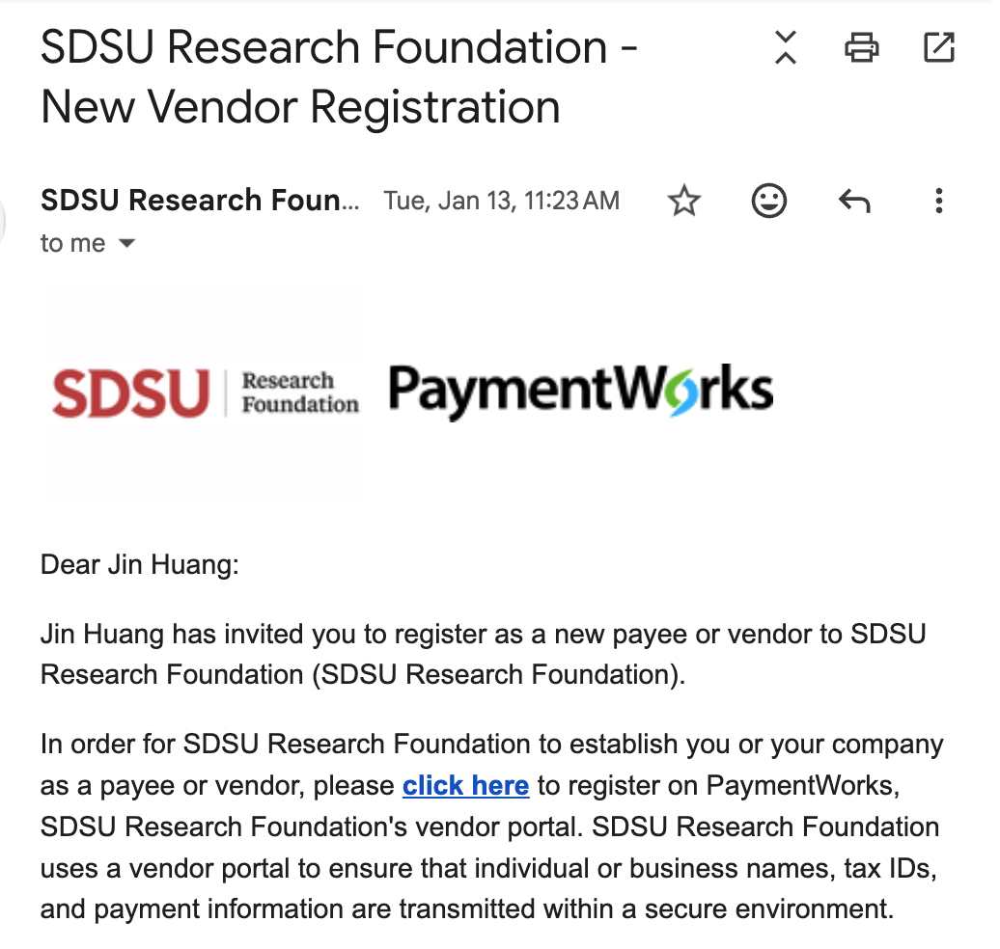{width=90% fig-alt="Vendor registration invitation email"}
:::

:::

### Step 2: Register Your Account
::: {.columns}

::: {.column width="45%"}

After completing the registration form, you will receive an activation email and log in once more.
:::

::: {.column width="55%"}
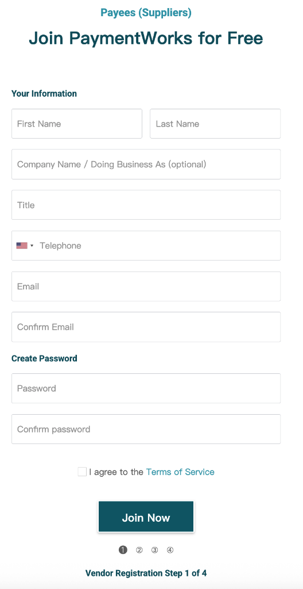{width=90% fig-alt="Vendor registration screen"}
:::

:::

### Step 3: Multi-Factor Authentication
::: {.columns}

::: {.column width="45%"}

You will be asked to complete multi-factor authentication using your phone number.
:::

::: {.column width="55%"}
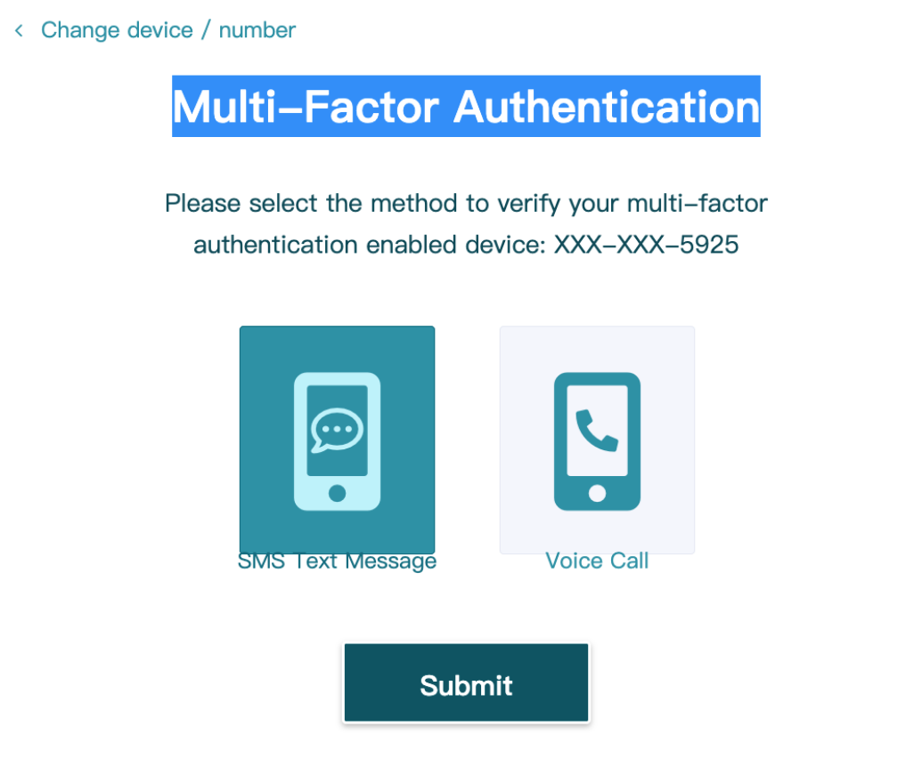{width=90% fig-alt="Multi-factor authentication screen"}
:::

:::

### Final Step: Complete Registration Based on Your Tax Residency (Approx. 10 - 15 Minutes)
Following are the instructions to complete the registration process.

## For tax purposes which best describes you?
The refund will goes directly to you, so you may choose "individual or sole proprietorship"
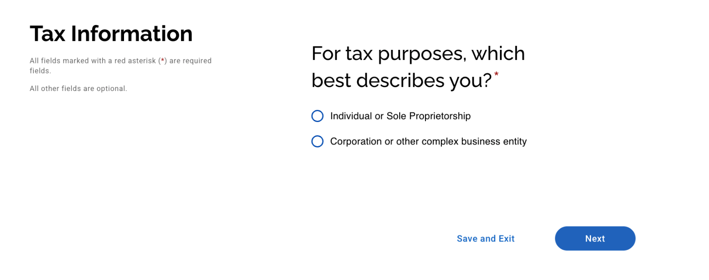

## Provide your tax information
::: {.columns}

::: {.column width="50%"}
::: {.callout-note}
**Resident Alien (for U.S. tax purposes)**

You are considered a resident alien if you meet either of the following IRS tests:

- **Green Card Test**: You are a lawful permanent resident of the United States at any time during the tax year; or
- **Substantial Presence Test**: You meet the IRS physical presence requirements based on the number of days you were present in the U.S. over the past three years.
- If you meet either test, you are treated as a U.S. person for tax purposes and should generally complete **Form W-9**, not **Form W-8BEN**.
- Please click the link on the web to got thoes forms
:::
:::

::: {.column width="50%"}
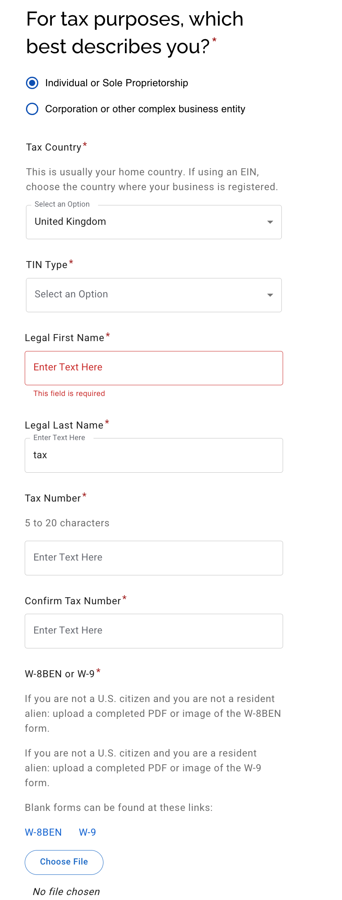{width=100%}
:::

:::

## Personal and Address Information

::: {.callout-note}
__Remittance Address__:  
Address where payment should be sent (e.g., check mailing address).
:::

::: {.columns}

::: {.column width="50%"}
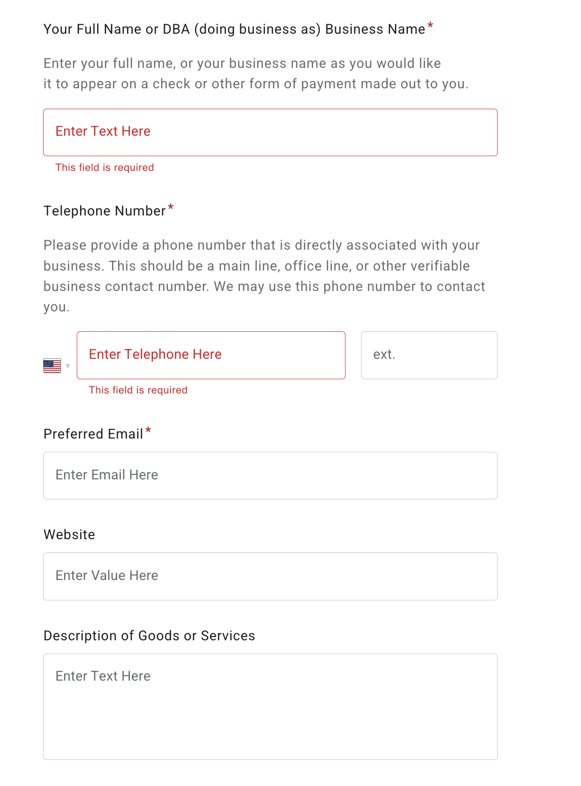{width=100%}
:::

::: {.column width="50%"}
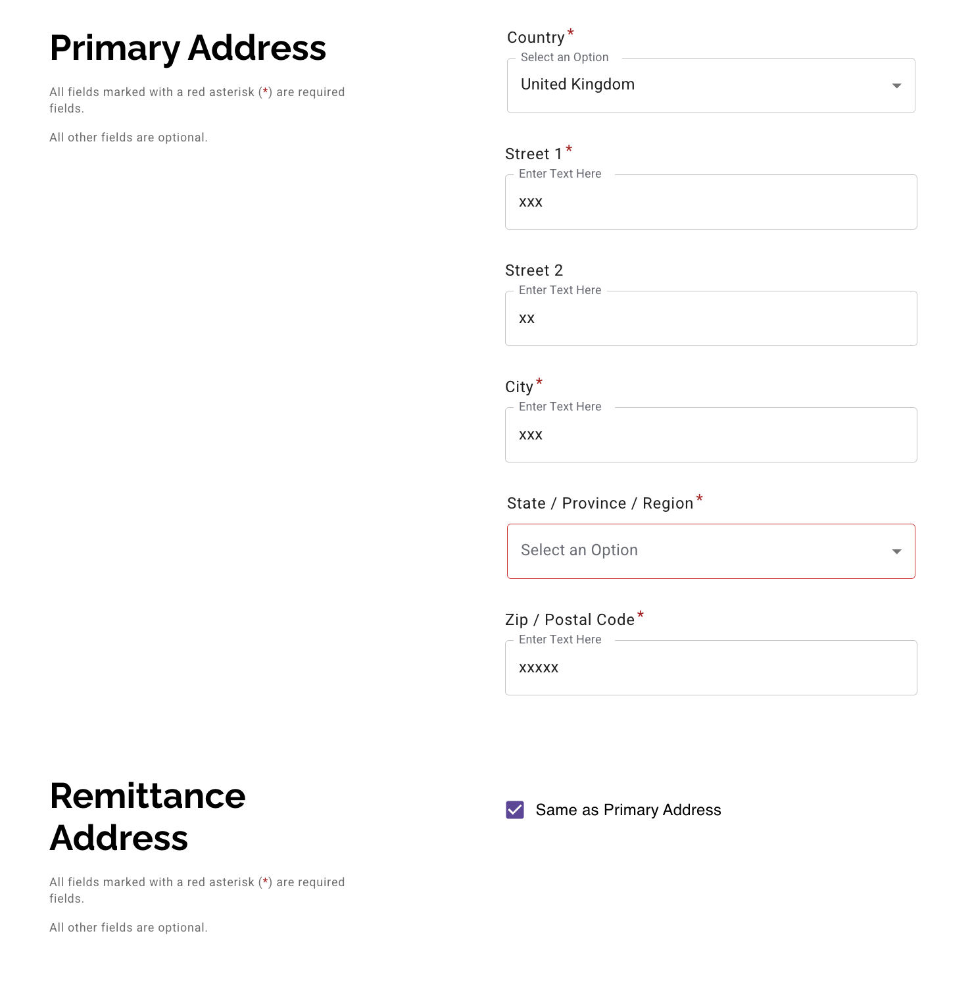{width=100%}
:::
:::

## Additional Information 

::: {.columns}

::: {.column width="50%"}
::: {.callout-note}
- Utilize the step by step guide provided in the image to assist with completion
- If you are SDSU/SDSURF student or employee you will need to fill your sdsuid
- These questions apply mainly to established businesses.
  - Do you accept credit cards?
  - Do you accept Purchase Orders?  
    Individuals can usually select **No**.
:::
:::

::: {.column width="50%"}
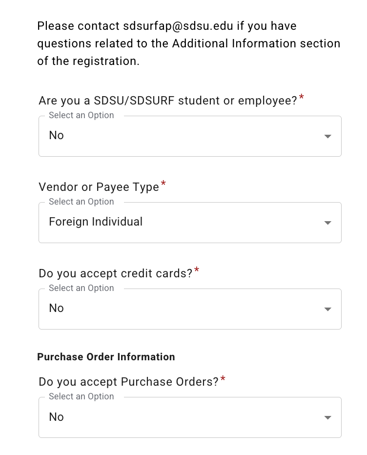{width=100%}
:::
:::

## Foreign Individual Tax Information

::: {.columns}

::: {.column width="50%"}
::: {.callout-note}
Reimbursements are not taxed; they would not qualify for tax treaty benefits, so you can ignore **Form 8233**.
:::
:::

::: {.column width="50%"}
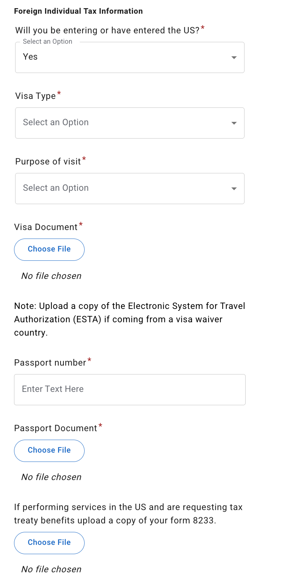{width=100%}
:::

:::

### Conflict of interest

::: {.columns}
::: {.column width="50%"}
::: {.callout-note}
In general, choose **No** as most of us are just requesting travel reimbursement.
:::
:::

::: {.column width="50%"}
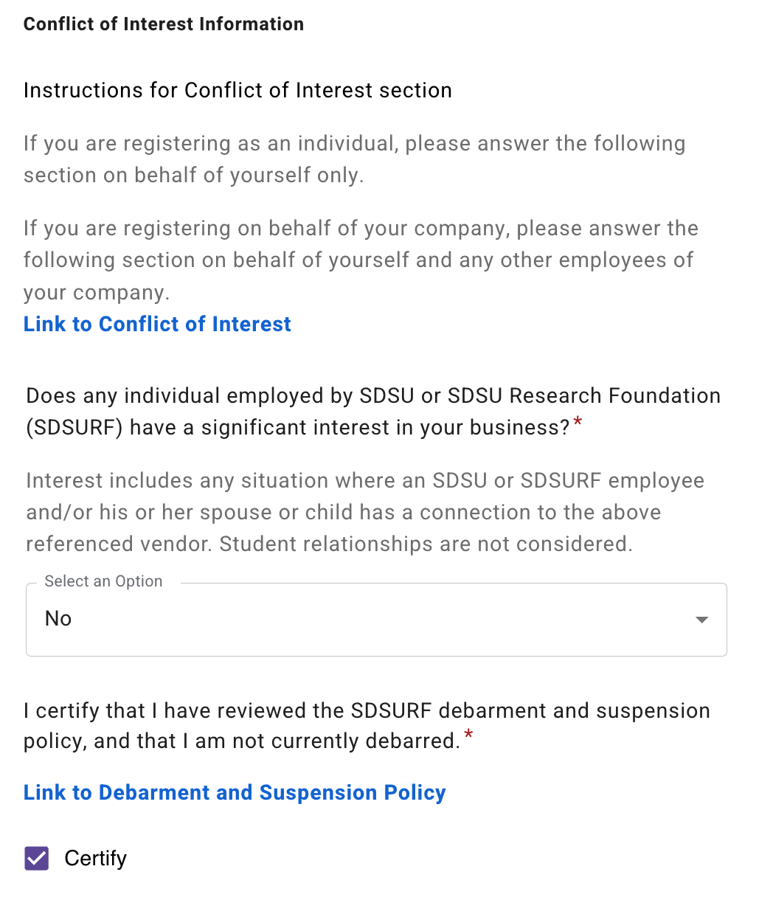{width=100%}
:::
:::

## Payment information

::: {.columns}
::: {.column width="50%"}
::: {.callout-note}
- **Wire**: Electronic bank transfer (faster, recommended for foreign bank accounts).
- **Check**: Paper check sent by mail (slower, higher risk, not recommended for foreign accounts).
:::
:::

::: {.column width="50%"}
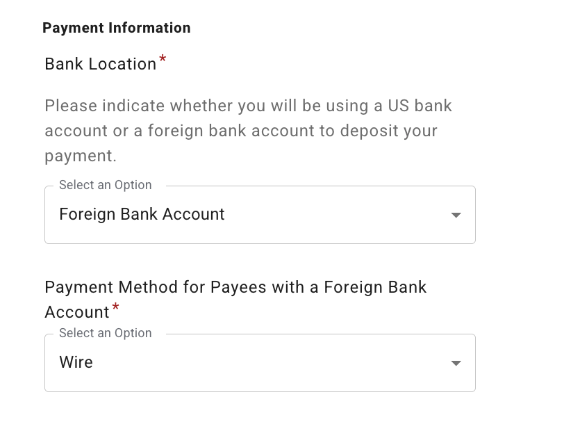{width=100%}
:::

:::

## Provide Your Bank Information

::: {.callout-note}
The backup document is used to verify that the information entered on the registration form is accurate.  
A document that includes **your bank routing number** and **your full bank account number** is preferred.
:::

::: {.columns}

::: {.column width="50%"}
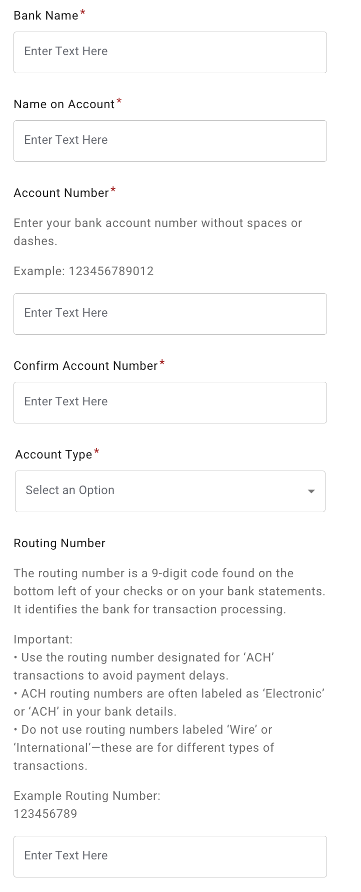{width=100%}
:::

::: {.column width="50%"}
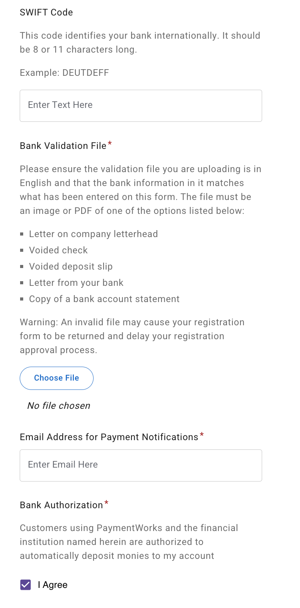{width=100%}
:::

:::

### Bank Address Information

::: {.columns}

::: {.column width="40%"}
::: {.callout-note}
The bank address does not have to be the branch where you originally opened your account.  
For example, if your bank account is with **Chase**, you may enter the address of **any Chase branch that is close to you**.Or you may use the bank address listed on your bank statement.
:::
:::

::: {.column width="60%"}
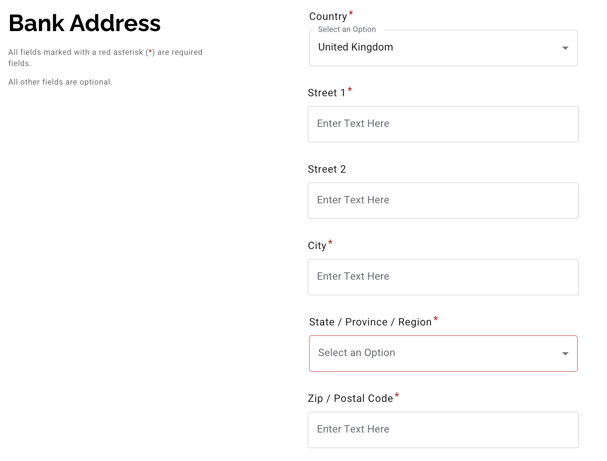{width=100%}
:::

:::

## Required Documents:   
After you have completed the vendor registration process, please submit the following documents through [International Submission_Link](https://docs.google.com/forms/d/e/1FAIpQLSd2fmeW3ro9HExFgx-v-EPc1mc1SWugzUtn376_tyjG7Tudmg/viewform?usp=header)

- **Receipts for transportation and lodging.**
- **A filled [Travel Reimbursement Form](https://docs.google.com/spreadsheets/d/1gnvgH35KitXtLpwvv8E47XNK_p2g4VP9/edit?usp=sharing&ouid=106028593616508914189&rtpof=true&sd=true)**
- **Wire Transfer Authorization Form [PDF](./files/wire_transfer_form.pdf)** (You only need to fill the sections before 'CODING FOR WIRE')

### Guidelines for filling out the Travel Reimbursement Form:
- **You can save a copy of the reimbursement form to your google drive and make edits.** 
- Lodging: You may enter the total lodging amount on the last day, but it is preferable to list the amount for each night separately.
- Please ensure receipts that are larger than $75 are reflected in the Travel Reimbursement Form. 
- Per diem policy:
    - Per diem is included in the $2000 reimbursement limit.
    - Per diem cannot be claimed if provided at a conference or event. 
    - The per diem rate for San Francisco is $92 per day for meals and incidental expenses (M&IE), which includes $23 for breakfast, $26 for lunch, $38 for dinner, and $5 for incidental expenses. 
    - On the first and last day of travel, the per diem is reduced to 75% of the daily rate, which equals $69.00.

- **For international attendees:**
    - All amounts need to be shown in USD on the reimbursement forms.
    - Accounts Payable suggests using [OANDA](https://www.oanda.com/currency-converter/en/?from=ZAR&to=USD&amount=1) to convert the amounts from your local currency to USD. For each receipt, enter the amount and date of the receipt. Take a screenshot of the conversion and upload it together with the receipt.

- When finishing the form, please download it as pdf and choose paper size B4. Upload the **pdf version of the form** to the submission link above.

**Use this link to track your reimbursement status:** [Track Reimbursement](https://docs.google.com/spreadsheets/d/13y4PGKPsvlH9bAoylsK7JmHMy_HNKQimaimEGKsTdFM/edit?gid=1918778147#gid=1918778147)

## Help and Support
If you have any questions or need assistance with the reimbursement process:

- Payments, vendor onboarding, reimbursement sheet related inquiries, please contact SDSU Research Foundation Accounts Payable at sdsurfap@sdsu.edu
- For questions about this reimbursement guidelines, please contact Jin Huang at jhuang7158@sdsu.edu